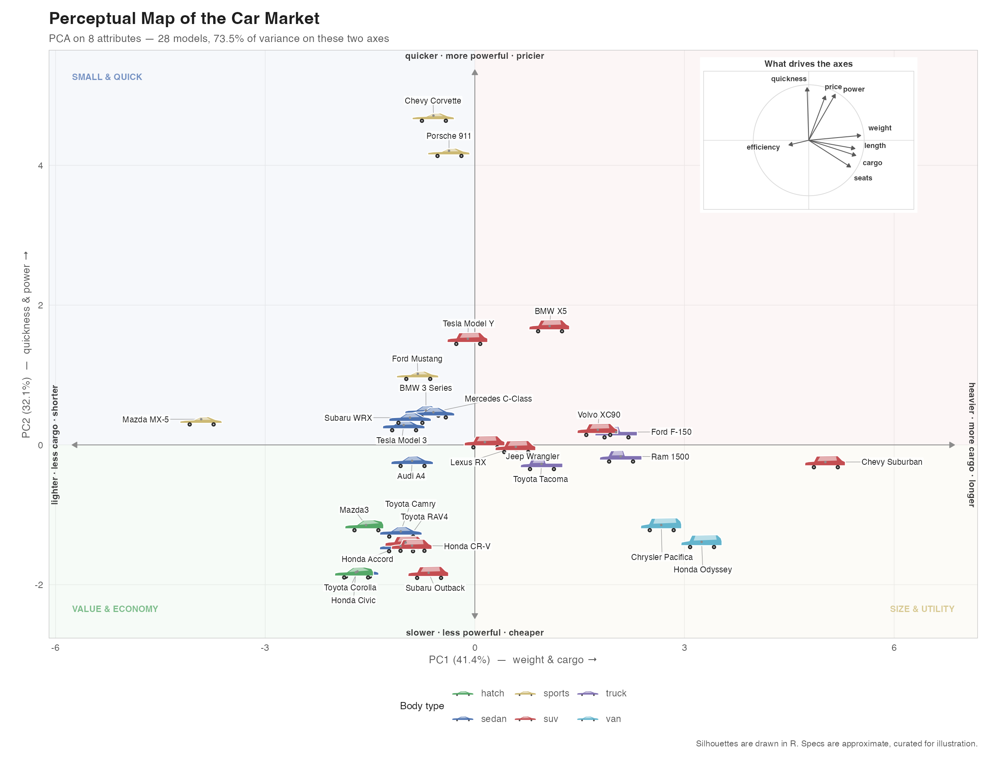

# Car Perceptual Map

A perceptual map of the car market, built in R. Cars are positioned by PCA on
their objective specs and drawn as silhouettes rendered directly by `grid` — no
image files, no downloads, no licensing questions. Runs offline.



## Run it

Open the project in RStudio, then:

```r
source("setup.R")        # check packages (reports only, never installs)
source("run_static.R")   # static map -> Plots pane + outputs/map.png|pdf
shiny::runApp()          # the interactive app (or click "Run App")
```

Everything runs on packages you already have: **ggplot2, shiny, bslib, DT,
patchwork, scales, grid, ragg**. Nothing to install.

## The app

- **Attributes** — tick attributes in or out; the PCA refits and the map moves.
- **Axes** — plot any pair of PC1–PC4.
- **Zoom** — drag a box, then double-click. Double-click empty space to reset.
  Because silhouettes are sized in *points*, not data units, zooming genuinely
  spreads a crowded cluster apart instead of magnifying it.
- **Click a car** for its spec card.
- **Body types**, silhouette size, labels, quadrants, hulls.
- **Light / dark toggle** in the header. It themes the entire app — chrome,
  cards, tables, both plots, and the downloaded PNG — not just the map.
- Tabs for variance explained, the loadings table, the raw data, and
  **How it works**, an in-app explanation of the whole pipeline that reports the
  variance and axis names of whatever fit is currently on screen.
- **Download PNG** exports the current view at 200 dpi.

## How the map is built

`fit_map()` scales every attribute, runs `stats::prcomp`, and pins each axis's
sign so the map is identical on every run. Two transforms happen first:

- `0-60` is negated, so every arrow points the intuitive way ("more is more").
- `mpg` is log-transformed. EV MPGe (122–132) against petrol MPG (18–36) would
  otherwise turn that variable into an "is it an EV" indicator that contributes
  almost nothing to the first two components.

Arrows in the compass are **variable–score correlations**, not raw eigenvectors.
That is the correlation-biplot scaling: everything sits inside the unit circle,
and an arrow's length is how well that attribute is represented on the two axes
on screen.

With all 8 attributes: **PC1 41.4%** (weight, cargo, length, seats — size and
utility) and **PC2 32.1%** (quickness, power, price — performance and price),
so **73.5%** of the variance is on the two axes you see.

## Files

| Path | What it does |
|---|---|
| `data/cars.csv` | 28 models x 8 attributes. Edit or extend it; nothing else needs changing. |
| `R/silhouettes.R` | Body-type polygon shapes, `car_grob()`, and the `GeomCar` ggplot2 geom. |
| `R/pca.R` | `fit_map()`, transforms, sign pinning, `axis_name()`. |
| `R/layout.R` | Axis limits, aspect fitting, label repel, inset corner picking. |
| `R/plot.R` | `build_map()`, `build_compass()`, `compose_map()`, `pm_bg()`, theming. |
| `R/explain.R` | The How it works tab, generated from `CARS` / `ATTRS` so it cannot go stale. |
| `app.R` | The Shiny app. |
| `run_static.R` | Static export. |
| `setup.R` | Package check. |

## Two implementation notes

**Why a custom Geom rather than `annotation_custom()`.** `annotation_custom()`
is not vectorised — passing vectors to `xmin`/`xmax` is a hard error in
ggplot2 4.0 — so it needs one layer per car and replicates into every facet.
More importantly it sizes in data units, so cars grow as you zoom and a dense
cluster never decongests. `GeomCar` emits one grob per row in a single layer,
sized in points.

**Why the compass is an inset in the static map but a side panel in the app.**
A `patchwork` inset overrides the plot's coordmap, so Shiny resolves clicks and
brushes against the *inset's* scales instead of the map's. The static export has
no interaction, so it keeps the inset; the app renders the compass separately
and leaves the map a plain `ggplot`.

## Caveats

The specs are hand-curated approximations of 2020s models, assembled to make a
readable market map — not an authoritative spec database. Swap in your own
numbers in `data/cars.csv`.

`gt::gtcars` is an alternative real, citable dataset, but it is supercar-heavy
(Ferrari, Lamborghini, Aston Martin, 2014–2017) with no Corolla or F-150, so it
cannot show mainstream market spread.

## License

[MIT](LICENSE) © 2026 Azlan Ahmad

The car specifications in `data/cars.csv` are hand-compiled approximations
assembled for illustration, not licensed data from any manufacturer or
third-party database.
